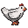
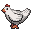
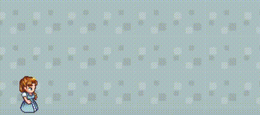
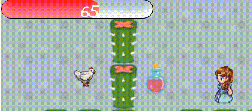

# Tillie-s-adventure

## Background and Overview

Tillie's Advendure is a adventure game with a background of a little girl - Tillie rescue her animal friends. 
Monsters/Spiders will be on patrol, Tillie needs to watch out for them. 

* Monsters will chase after Tillie if the radius between two objects falls into 50pxs. 

* Hit by monster will continuously losing Hit Point. The damage will be different depending on the scale of monsters.

* Pickup potions will heal the HP by 10. 

* So far there are only 3 Levels to play, successfully resecured designated animals will pass to next level. 

## Technologies

* Vanilla JavaScript 

* HTML

* Canvas

* CSS

* webpack

## Features

Users will play the role of Tillie and use arrow keys to move the Tillie to dodge the monsters and rescue the friends.

Monsters will following Tillie if she is too close! By using collision detection withing certain distance.

    export function collision (obj1, obj2, distance){

    let rightOfobj1 = obj1.position.x + obj1.spriteWidth;
    let leftOfobj1 = obj1.position.x;
    let rightOfobj2 = obj2.position.x + obj2.spriteWidth;
    let leftOfobj2 = obj2.position.x;
    if (
        leftOfobj2 < rightOfobj1 + distance &&
        rightOfobj2 > leftOfobj1 - distance
    ) {
        return true;
    } else {
        return false;
    }
    }
    export function collisionUpDown(obj1, obj2, distance){

    let bottomOfobj1 = obj1.position.y + obj1.spriteHeight;
    let topOfobj1 = obj1.position.y;
    let bottomOfobj2 = obj2.position.y + obj2.spriteHeight;
    let topOfobj2 = obj2.position.y;

    if (bottomOfobj1 > topOfobj2 - distance &&
            topOfobj1 < bottomOfobj2 + distance )
        {
            return true;
        } else {
            return false;
        }
    }

At level 3, monsters will auto spawning in random position every 5 seconds.

    if(this.leveled === this.levelList(2)){

                this.repeat === true;

                var re = setInterval(() => {
                if (this.player.lives === 0 || stop) { clearInterval(re); }
                else{let xpo = Math.random() * 700;
                let ypo = Math.random() * 500;
                this.clone.push(new Spider(this, xpo, ypo, Math.random()*1.5));
                this.gameObjects = [this.player, ...walls, ...this.clone];}
            }, 5000);

There will be potions on the map for Tillie to pick up, they can recover 10 HP.

Different scale of monster will make differe amount of damage to Tillie.

    if (this.game.player.lives >0)
    {
            if (collision(this.game.player, this, -distance/2 ) && collisionUpDown(this.game.player, this, -(distance/2))) {    
                    if(this.scale>=1.2){this.game.player.lives -=1.5;}//damage from spider, the bigger the more damage.
                    else if (this.scale < 1.2&& this.scale>=0.8){this.game.player.lives -=0.8;}
                    else if(this.scale <0.8 && this.scale >=0.5){this.game.player.lives -=0.5;}
                    else{this.game.player.lives -= 0.1;}
        }}

##

